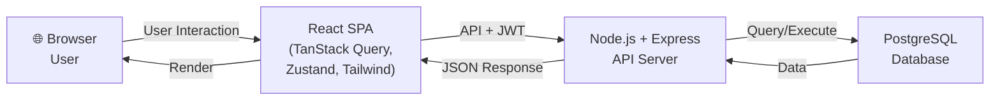
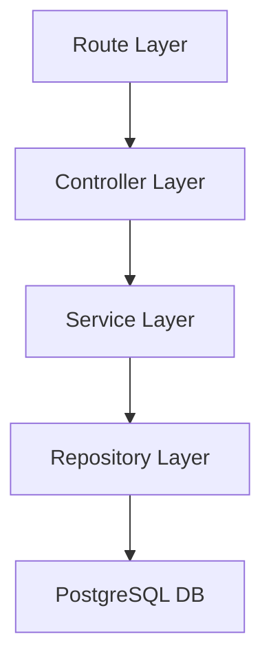
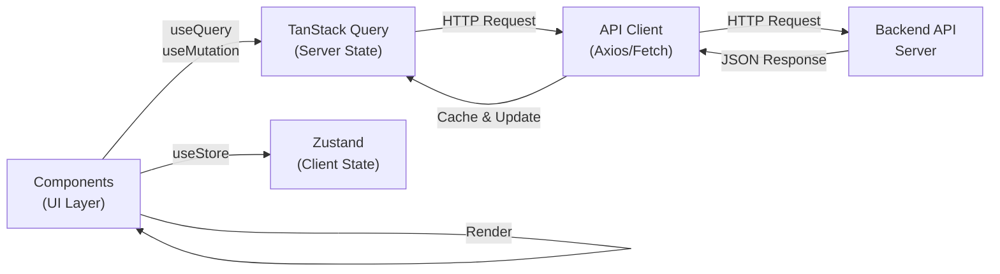
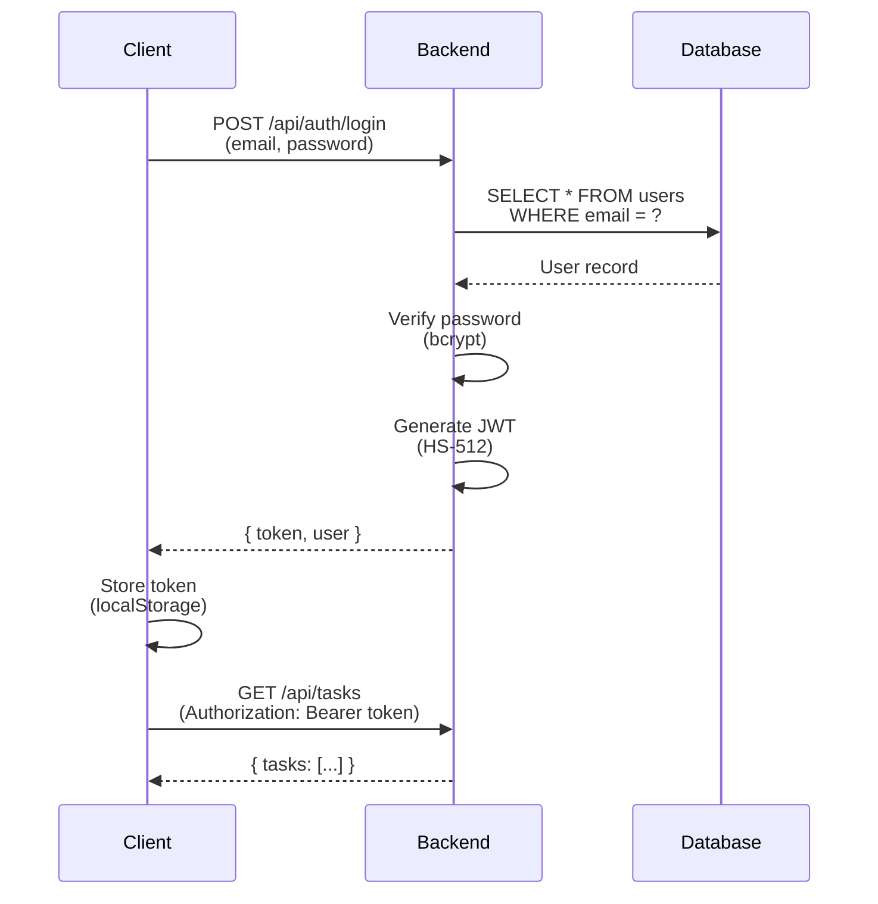
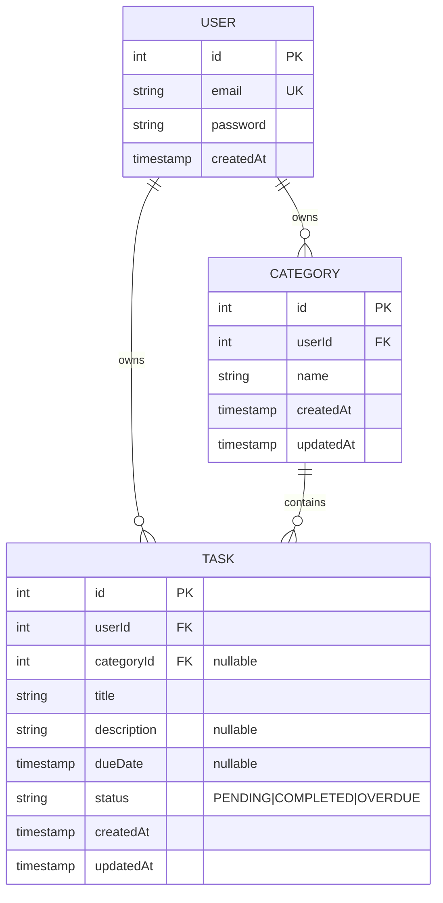

# 기술 아키텍처 다이어그램 - TodoList 애플리케이션

**버전:** 1.0
**작성일:** 2026-04-28
**작성자:** Documentation Engineer

> 변경 이력은 [6. 변경 이력](#6-변경-이력) 섹션에서 관리합니다.

---

## 1. 개요

이 문서는 TodoList 애플리케이션의 기술 아키텍처를 시각적으로 표현합니다. 시스템 구성, 백엔드 레이어 구조, 프론트엔드 상태 흐름, 인증 시퀀스, 데이터베이스 관계를 Mermaid 다이어그램으로 제시하여 개발팀의 빠른 이해와 온보딩을 지원합니다.

---

## 2. 시스템 전체 구조 (C4 Container 수준)

3-tier 아키텍처로 구성되며, 브라우저의 React SPA가 백엔드 API와 통신하고, 백엔드는 PostgreSQL 데이터베이스와 상호작용합니다. JWT 인증 토큰은 클라이언트에서 모든 API 요청에 포함되어 전송됩니다.

---

## 3. 백엔드 레이어 구조

계층형 아키텍처로 각 레이어가 명확한 책임을 가집니다. Route → Controller → Service → Repository → DB 순서로 요청이 처리되며, Repository 패턴을 통해 데이터 접근을 추상화합니다.

---

## 4. 프론트엔드 상태 흐름

프론트엔드는 두 가지 상태 관리 메커니즘을 사용합니다. TanStack Query는 서버 상태(API 데이터)를 관리하고, Zustand는 클라이언트 상태(UI 상태, 인증 정보)를 관리합니다.

---

## 5. 인증 시퀀스 다이어그램

사용자의 로그인 과정을 시퀀스 다이어그램으로 표현합니다. 클라이언트가 자격증명을 전송하면 백엔드는 데이터베이스에서 사용자 확인 후 JWT 토큰을 발급하고, 클라이언트는 이를 저장하여 이후 API 요청에 사용합니다.

---

## 6. 데이터베이스 ERD (Entity-Relationship Diagram)

세 가지 핵심 엔티티와 그들 간의 관계를 표현합니다. User는 여러 Category와 Task를 소유하며, Category는 여러 Task를 포함할 수 있습니다. 모든 데이터는 userId를 통해 사용자별로 격리됩니다.

---

## 7. API 엔드포인트 요약

### 인증 (Authentication)
- `POST /api/auth/register` — 회원가입
- `POST /api/auth/login` — 로그인
- `POST /api/auth/logout` — 로그아웃

### 카테고리 (Categories)
- `GET /api/categories` — 사용자의 모든 카테고리 조회
- `POST /api/categories` — 새 카테고리 생성
- `PUT /api/categories/:id` — 카테고리 수정
- `DELETE /api/categories/:id` — 카테고리 삭제

### 할일 (Tasks)
- `GET /api/tasks` — 할일 목록 조회 (필터 지원)
- `POST /api/tasks` — 새 할일 생성
- `PUT /api/tasks/:id` — 할일 수정
- `DELETE /api/tasks/:id` — 할일 삭제
- `PATCH /api/tasks/:id/complete` — 할일 완료 처리
- `PATCH /api/tasks/:id/reopen` — 완료 취소

---

## 8. 기술 스택 요약

| 계층 | 기술 | 버전 |
|------|------|------|
| **Frontend** | React | 19 |
| | TanStack Query | v5+ |
| | Zustand | v4+ |
| | Tailwind CSS | v3+ |
| **Backend** | Node.js | 24 |
| | Express | 5 |
| | pg (node-postgres) | v8+ |
| **Database** | PostgreSQL | 14+ |
| **Authentication** | JWT | HS-512 |

---

## 9. 데이터 흐름 예시: 할일 목록 조회

1. 사용자가 UI에서 할일 목록을 요청
2. React Component가 `useQuery` 훅으로 TanStack Query에 요청
3. TanStack Query가 API Client를 통해 `GET /api/tasks` 호출
4. Backend Route가 요청을 받아 Controller로 전달
5. Controller가 Service의 비즈니스 로직 호출
6. Service가 Repository를 통해 DB에서 데이터 조회
7. 데이터가 역순으로 전달되어 Frontend는 캐싱 후 UI 렌더링

---

## 10. 주요 설계 원칙

- **계층 분리**: 각 계층은 명확한 책임을 가지며, 하위 계층에만 의존
- **의존성 역전**: Repository 패턴으로 데이터 접근을 추상화
- **인증 중앙화**: JWT를 통한 상태 비저장(Stateless) 인증
- **상태 관리 분리**: 서버 상태와 클라이언트 상태를 명확히 구분
- **데이터 격리**: userId를 기준으로 모든 데이터 접근 제어

---

## 11. 변경 이력

### 변경 유형 코드

| 코드 | 의미 |
|------|------|
| `NEW` | 신규 항목 추가 |
| `MOD` | 기존 항목 수정 |
| `DEL` | 항목 삭제 |
| `FIX` | 오류 수정 |

### 이력 테이블

| 버전 | 변경일 | 작성자 | 유형 | 변경 내용 | 영향 범위 |
|------|--------|--------|------|-----------|-----------|
| 1.0 | 2026-04-28 | Documentation Engineer | NEW | 최초 문서 작성 — 5개 Mermaid 다이어그램(시스템 구조, 백엔드 레이어, 프론트엔드 상태 흐름, 인증 시퀀스, DB ERD), API 엔드포인트 요약, 기술 스택, 데이터 흐름 예시, 설계 원칙 정의 | 전체 |

### 변경 이력 작성 가이드

- **버전 규칙**: `MAJOR.MINOR` 형식 사용
  - `MAJOR` 증가: 전체 아키텍처의 구조적 변경 (예: 계층 추가/삭제, 새로운 서비스 추가)
  - `MINOR` 증가: 다이어그램 보완, 설명 개선, 신규 섹션 추가
- **변경 시 필수 작업**:
  1. 이 테이블에 새 행 추가 (최신 버전이 아래)
  2. 문서 헤더의 **버전** 및 **작성일** 업데이트
  3. 변경된 다이어그램 번호를 영향 범위에 명시 (예: "다이어그램 2, 3")
