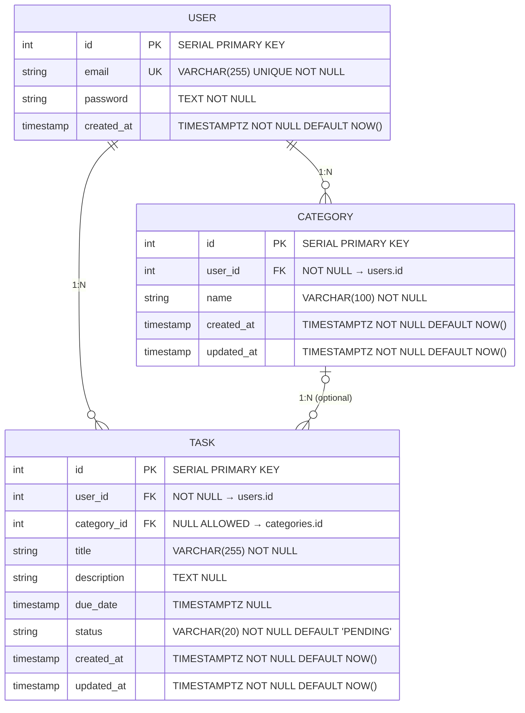

# ERD (Entity-Relationship Diagram) - TodoList 애플리케이션

**버전:** 1.0  
**작성일:** 2026-04-28  
**작성자:** Database Architect  
**최종 수정일:** 2026-04-28

> 참조 문서:
> - [1-domain-definition.md](./1-domain-definition.md) - 도메인 정의서 v1.1
> - [4-project-structure.md](./4-project-structure.md) - 프로젝트 구조

---

## 1. 개요

본 문서는 TodoList 애플리케이션의 데이터베이스 스키마를 Entity-Relationship Diagram(ERD) 형식으로 정의합니다. 도메인 정의서의 세 가지 핵심 엔티티(User, Category, Task)와 그들 간의 관계, 제약 조건, 인덱스 전략을 포함합니다.

---

## 2. 메인 ERD 다이어그램



### ERD 설명

- **USER**: 애플리케이션의 인증 주체. 모든 데이터의 소유권 기준
- **CATEGORY**: 사용자별 할일 분류 레이블. 사용자 범위 내에서 이름 중복 불가
- **TASK**: 사용자의 실제 할일 항목. 카테고리는 선택 사항 (미분류 할일 허용)

---

## 3. 테이블 명세 (PostgreSQL DDL)

### 3.1 users 테이블

```sql
CREATE TABLE users (
    id SERIAL PRIMARY KEY,
    email VARCHAR(255) NOT NULL UNIQUE,
    password TEXT NOT NULL,
    created_at TIMESTAMPTZ NOT NULL DEFAULT NOW()
);

CREATE INDEX idx_users_email ON users(email);
```

**컬럼 설명**

| 컬럼명 | 타입 | 제약 | 설명 |
|--------|------|------|------|
| `id` | SERIAL | PK | 고유 사용자 식별자. 자동 증가 정수 |
| `email` | VARCHAR(255) | UNIQUE, NOT NULL | 로그인 식별자. 전체 시스템에서 유일 (BR-02) |
| `password` | TEXT | NOT NULL | bcrypt 해시된 비밀번호. 평문 저장 금지 (BR-03) |
| `created_at` | TIMESTAMPTZ | NOT NULL, DEFAULT NOW() | 계정 생성 일시. UTC 기준 타임스탬프 |

**인덱스**

- `idx_users_email`: 로그인 시 이메일 검색 성능 최적화

---

### 3.2 categories 테이블

```sql
CREATE TABLE categories (
    id SERIAL PRIMARY KEY,
    user_id INTEGER NOT NULL REFERENCES users(id) ON DELETE CASCADE,
    name VARCHAR(100) NOT NULL,
    created_at TIMESTAMPTZ NOT NULL DEFAULT NOW(),
    updated_at TIMESTAMPTZ NOT NULL DEFAULT NOW(),
    CONSTRAINT uk_categories_user_name UNIQUE(user_id, name)
);

CREATE INDEX idx_categories_user_id ON categories(user_id);
```

**컬럼 설명**

| 컬럼명 | 타입 | 제약 | 설명 |
|--------|------|------|------|
| `id` | SERIAL | PK | 고유 카테고리 식별자 |
| `user_id` | INTEGER | FK, NOT NULL, ON DELETE CASCADE | 소유 사용자 참조. 사용자 삭제 시 카테고리도 삭제 (BR-09) |
| `name` | VARCHAR(100) | NOT NULL | 카테고리 이름. 동일 사용자 내에서 중복 불가 (BR-04) |
| `created_at` | TIMESTAMPTZ | NOT NULL, DEFAULT NOW() | 카테고리 생성 일시 |
| `updated_at` | TIMESTAMPTZ | NOT NULL, DEFAULT NOW() | 카테고리 마지막 수정 일시 |

**제약 조건**

- `uk_categories_user_name`: 복합 UNIQUE 제약. (user_id, name) 조합이 고유해야 함 (BR-04)

**인덱스**

- `idx_categories_user_id`: 특정 사용자의 카테고리 목록 조회 성능 최적화

---

### 3.3 tasks 테이블

```sql
CREATE TABLE tasks (
    id SERIAL PRIMARY KEY,
    user_id INTEGER NOT NULL REFERENCES users(id) ON DELETE CASCADE,
    category_id INTEGER REFERENCES categories(id) ON DELETE SET NULL,
    title VARCHAR(255) NOT NULL,
    description TEXT,
    due_date TIMESTAMPTZ,
    status VARCHAR(20) NOT NULL DEFAULT 'PENDING',
    created_at TIMESTAMPTZ NOT NULL DEFAULT NOW(),
    updated_at TIMESTAMPTZ NOT NULL DEFAULT NOW()
);

CREATE INDEX idx_tasks_user_id ON tasks(user_id);
CREATE INDEX idx_tasks_category_id ON tasks(category_id);
CREATE INDEX idx_tasks_user_status ON tasks(user_id, status);
CREATE INDEX idx_tasks_due_date ON tasks(due_date) WHERE status = 'PENDING';
```

**컬럼 설명**

| 컬럼명 | 타입 | 제약 | 설명 |
|--------|------|------|------|
| `id` | SERIAL | PK | 고유 할일 식별자 |
| `user_id` | INTEGER | FK, NOT NULL, ON DELETE CASCADE | 소유 사용자 참조. 사용자 삭제 시 할일도 삭제 (BR-09) |
| `category_id` | INTEGER | FK, NULL ALLOWED, ON DELETE SET NULL | 소속 카테고리 참조. NULL 허용 (미분류 할일). 카테고리 삭제 시 NULL로 설정 (BR-05) |
| `title` | VARCHAR(255) | NOT NULL | 할일 제목 |
| `description` | TEXT | NULL | 할일 상세 설명. 선택 사항 |
| `due_date` | TIMESTAMPTZ | NULL | 할일 마감일시. NULL 허용 (기한이 없는 할일) |
| `status` | VARCHAR(20) | NOT NULL, DEFAULT 'PENDING' | 할일 상태. DB에는 `PENDING` 또는 `COMPLETED`만 저장. `OVERDUE`는 조회 시 계산 (BR-06) |
| `created_at` | TIMESTAMPTZ | NOT NULL, DEFAULT NOW() | 할일 생성 일시 |
| `updated_at` | TIMESTAMPTZ | NOT NULL, DEFAULT NOW() | 할일 마지막 수정 일시 |

**인덱스**

- `idx_tasks_user_id`: 특정 사용자의 할일 목록 조회
- `idx_tasks_category_id`: 카테고리별 할일 조회
- `idx_tasks_user_status`: 사용자별·상태별 할일 필터링
- `idx_tasks_due_date` (partial): 기한 초과 판별이 필요한 PENDING 할일 조회 성능 최적화

---

## 4. 관계 설명표

| 관계명 | 관계 유형 | 카디널리티 | FK 컬럼 | 참조 대상 | ON DELETE 정책 | 설명 |
|--------|----------|-----------|---------|----------|----------------|------|
| USER_CATEGORY | 1:N | 1(User) : N(Category) | `categories.user_id` | `users.id` | CASCADE | 한 사용자는 여러 카테고리를 소유할 수 있다. 사용자 삭제 시 모든 카테고리도 삭제된다. |
| USER_TASK | 1:N | 1(User) : N(Task) | `tasks.user_id` | `users.id` | CASCADE | 한 사용자는 여러 할일을 소유할 수 있다. 사용자 삭제 시 모든 할일도 삭제된다. |
| CATEGORY_TASK | 1:N (선택) | 1(Category) : N(Task) | `tasks.category_id` | `categories.id` | SET NULL | 한 카테고리는 여러 할일을 가질 수 있다. category_id는 NULL 허용이므로 카테고리 삭제 시 할일은 삭제되지 않고 NULL로 설정되어 미분류 상태가 된다. |

---

## 5. 설계 노트

### 5.1 OVERDUE 상태의 DB 미저장 설계 (BR-06)

**설계 결정사항**
- DB에는 `PENDING`과 `COMPLETED` 두 가지 상태만 저장
- `OVERDUE` 상태는 조회 시 서비스 레이어에서 실시간 계산

**근거**
- **시간 불변성 (Time Invariance)**: 카테고리, 제목 등과 달리 상태는 시간에 따라 자동 변경됨. 매번 업데이트할 필요 없음
- **저장소 간결성**: 불필요한 배치 작업 제거 (자정마다 PENDING→OVERDUE 전환 배치 불필요)
- **실시간 정확성**: 사용자가 조회하는 시점의 현재 시각과 due_date를 비교하므로 항상 최신 정보 제공
- **데이터 정규화**: 계산 가능한 속성(파생 속성)을 DB에 중복 저장하지 않음 (제1정규형 준수)

**구현 로직**
```
상태 판별 규칙:
- due_date가 NULL인 경우 → PENDING (종료일 없는 할일)
- status = 'COMPLETED' → COMPLETED (완료 여부 우선)
- due_date < NOW() AND status = 'PENDING' → OVERDUE (기한 초과)
- 그 외 → PENDING
```

---

### 5.2 category_id의 NULL 허용 설계 (BR-05)

**설계 결정사항**
- `tasks.category_id`는 NULL을 허용하는 선택적 FK

**근거**
- **카테고리 삭제 시 할일 보존**: 카테고리 삭제 시 ON DELETE SET NULL로 설정하여 할일이 함께 삭제되지 않음 (사용자 데이터 보전)
- **미분류 할일 지원**: 사용자가 카테고리를 선택하지 않고 할일을 생성할 수 있음 (더 유연한 UX)
- **데이터 무결성**: 고아 레코드(orphaned record) 방지. 참조되던 카테고리 삭제 후에도 할일 유지

**쿼리 예시**
```sql
-- 카테고리 삭제 시
DELETE FROM categories WHERE id = 5 AND user_id = 1;
-- 결과: 해당 카테고리의 모든 할일 → category_id = NULL (미분류)

-- 미분류 할일 조회
SELECT * FROM tasks WHERE user_id = 1 AND category_id IS NULL;
```

---

### 5.3 복합 UNIQUE 제약 설계 (BR-04)

**설계 결정사항**
- `categories(user_id, name)` 복합 UNIQUE 제약

**근거**
- **사용자별 격리**: 각 사용자는 독립적인 네임스페이스를 가짐 (BR-09)
- **유연한 카테고리명**: 서로 다른 사용자는 같은 이름의 카테고리를 가질 수 있음
  - User A: "업무", "개인" 생성 가능
  - User B: "업무", "개인" 생성 가능 (충돌 없음)
- **중복 방지**: 동일 사용자는 같은 이름의 카테고리를 두 개 이상 가질 수 없음

**쿼리 예시**
```sql
-- 새 카테고리 생성 시 중복 검사
SELECT COUNT(*) FROM categories 
WHERE user_id = 1 AND name = '업무';
-- 결과: 0이면 생성 가능, 1 이상이면 이미 존재

-- 카테고리 이름 변경 시 (다른 카테고리는 같은 이름 불가)
UPDATE categories SET name = '긴급'
WHERE id = 3 AND user_id = 1;
-- 제약 위반 시 UNIQUE 오류 발생
```

---

### 5.4 비밀번호 해시 저장 설계 (BR-03)

**설계 결정사항**
- `users.password` 컬럼에는 평문(plaintext)이 아닌 bcrypt 해시값만 저장

**근거**
- **보안**: 평문 저장 금지. DB 유출 시에도 비밀번호 복구 불가능
- **단방향 암호화**: bcrypt는 단방향 함수로, 해시값에서 평문 복원 불가능
- **솔트(Salt) 내장**: bcrypt는 각 해시에 고유 솔트 포함 → 동일 비밀번호도 다른 해시값 생성
- **규정 준수**: GDPR, HIPAA 등 보안 규정 준수

**구현 예시**
```
가입 시:
입력 비밀번호: "MyPassword@123"
→ bcrypt.hash() 호출
→ 저장 값: "$2b$12$K9h3IWmlS5kDT33xkVcLe.8Z7YfWIKiJCb2mY9mP5kH7z8jK2L4Jm"

로그인 시:
입력 비밀번호: "MyPassword@123"
→ bcrypt.compare(입력, DB의 해시값) 호출
→ 일치 여부 판별 (평문 비교 금지)
```

---

### 5.5 타임스탬프 설정 (TIMESTAMPTZ)

**설계 결정사항**
- 모든 날짜/시간 컬럼은 `TIMESTAMPTZ` (with timezone) 사용
- 기본값은 `DEFAULT NOW()` (현재 UTC 시각)

**근거**
- **국제화**: 사용자가 다양한 시간대에서 접근 가능. UTC 기준 저장 후 클라이언트에서 변환
- **일관성**: 모든 기록이 동일 기준(UTC)으로 저장되어 시간 비교·계산 용이
- **정밀도**: TIMESTAMP만으로는 시간대 정보 손실 가능. TIMESTAMPTZ는 오프셋 포함

---

## 6. 데이터 격리 및 보안 (BR-09)

모든 쿼리는 `user_id`로 데이터를 필터링하여 사용자별 완전 격리를 보장합니다.

### 6.1 쿼리 작성 원칙

```sql
-- ✓ 올바른 예: 현재 사용자의 카테고리만 조회
SELECT * FROM categories 
WHERE user_id = $1;

-- ✗ 잘못된 예: user_id 없이 조회 (다른 사용자 데이터 노출)
SELECT * FROM categories;

-- ✓ 올바른 예: 특정 카테고리 접근 시 소유권 검증
SELECT * FROM categories 
WHERE id = $1 AND user_id = $2;
```

### 6.2 CASCADE vs SET NULL 전략

| 관계 | ON DELETE 정책 | 이유 |
|------|----------------|------|
| users → categories | CASCADE | 사용자 삭제 시 소유 카테고리도 삭제 (사용자 격리 강제) |
| users → tasks | CASCADE | 사용자 삭제 시 소유 할일도 삭제 (사용자 격리 강제) |
| categories → tasks | SET NULL | 카테고리 삭제 시 할일은 보존, 카테고리만 제거 (데이터 보전) |

---

## 7. 성능 최적화 전략

### 7.1 인덱스 전략

| 테이블 | 인덱스명 | 컬럼 | 유형 | 용도 |
|--------|----------|------|------|------|
| users | `idx_users_email` | email | BTREE | 로그인 시 이메일 검색 |
| categories | `idx_categories_user_id` | user_id | BTREE | 사용자의 카테고리 목록 조회 |
| tasks | `idx_tasks_user_id` | user_id | BTREE | 사용자의 할일 목록 조회 |
| tasks | `idx_tasks_category_id` | category_id | BTREE | 카테고리별 할일 조회 |
| tasks | `idx_tasks_user_status` | (user_id, status) | BTREE | 사용자별 상태 필터링 |
| tasks | `idx_tasks_due_date` | due_date (partial: status='PENDING') | BTREE | OVERDUE 판별 최적화 |

### 7.2 주요 쿼리 성능 고려사항

```sql
-- 사용자의 OVERDUE 할일 조회 (인덱스 활용)
SELECT * FROM tasks
WHERE user_id = $1
  AND status = 'PENDING'
  AND due_date < NOW()
ORDER BY due_date ASC;
-- 인덱스 활용: idx_tasks_user_status, idx_tasks_due_date

-- 카테고리별 할일 통계
SELECT category_id, COUNT(*) as count, status
FROM tasks
WHERE user_id = $1
GROUP BY category_id, status;
-- 인덱스 활용: idx_tasks_user_id

-- 페이지네이션 조회
SELECT * FROM tasks
WHERE user_id = $1
ORDER BY created_at DESC
LIMIT 20 OFFSET 0;
-- 인덱스 활용: idx_tasks_user_id
```

---

## 8. 데이터 무결성 검증

### 8.1 FK 제약 검증

```sql
-- 카테고리 FK 검증
-- category_id가 존재하지 않는 경우 INSERT/UPDATE 실패
INSERT INTO tasks (user_id, category_id, title, status)
VALUES (1, 999, 'Invalid Category', 'PENDING');
-- 에러: FOREIGN KEY constraint violated

-- 카테고리 삭제 시 자동 처리
DELETE FROM categories WHERE id = 5;
-- 해당 카테고리의 모든 할일 → category_id = NULL
```

### 8.2 UNIQUE 제약 검증

```sql
-- 이메일 UNIQUE 검증
INSERT INTO users (email, password)
VALUES ('user@example.com', '$2b$12$...');
-- 같은 이메일로 재삽입 시 에러

-- 카테고리명 복합 UNIQUE 검증
INSERT INTO categories (user_id, name)
VALUES (1, '업무');
-- 사용자 1의 '업무' 카테고리가 이미 존재하면 에러
```

---

## 9. 마이그레이션 시나리오

### 9.1 테이블 생성 순서

1. **users** 생성 (최상위 독립 엔티티)
2. **categories** 생성 (user_id FK 참조)
3. **tasks** 생성 (user_id, category_id FK 참조)

```sql
-- 마이그레이션 실행 순서
-- 1. create_users.sql
CREATE TABLE users (...);

-- 2. create_categories.sql
CREATE TABLE categories (...);

-- 3. create_tasks.sql
CREATE TABLE tasks (...);

-- 4. create_indexes.sql
CREATE INDEX idx_users_email ON users(email);
-- ... 기타 인덱스
```

### 9.2 테이블 삭제 순서 (Rollback)

역순으로 진행 (FK 의존성 고려):

```sql
-- 역순 삭제
DROP TABLE IF EXISTS tasks CASCADE;
DROP TABLE IF EXISTS categories CASCADE;
DROP TABLE IF EXISTS users CASCADE;
```

---

## 10. 릴리스 노트

### 10.1 데이터베이스 호환성

- **PostgreSQL 버전**: 12.0 이상 권장
- **지원 기능**:
  - TIMESTAMPTZ 타입
  - SERIAL 자동 증가
  - ON DELETE CASCADE/SET NULL 정책
  - 복합 UNIQUE 제약
  - Partial 인덱스 (WHERE 절)

---

## 11. 변경 이력

### 변경 유형 코드

| 코드 | 의미 |
|------|------|
| `NEW` | 신규 항목 추가 |
| `MOD` | 기존 항목 수정 |
| `DEL` | 항목 삭제 |
| `FIX` | 오류 수정 |

### 이력 테이블

| 버전 | 변경일 | 작성자 | 유형 | 변경 내용 | 영향 범위 |
|------|--------|--------|------|-----------|-----------|
| 1.0 | 2026-04-28 | Database Architect | NEW | 초기 ERD 문서 작성 — Mermaid 다이어그램, PostgreSQL DDL, 관계 명세, 설계 노트(OVERDUE 미저장, category_id NULL 허용, 복합 UNIQUE), 인덱스 전략, 보안 설계, 성능 최적화 포함 | 전체 |

---

## 부록 A. SQL 전체 스크립트

```sql
-- ============================================================
-- TodoList Application Database Schema
-- PostgreSQL 12.0+
-- ============================================================

-- 테이블 삭제 (개발 환경용)
DROP TABLE IF EXISTS tasks CASCADE;
DROP TABLE IF EXISTS categories CASCADE;
DROP TABLE IF EXISTS users CASCADE;

-- ============================================================
-- 1. users 테이블
-- ============================================================
CREATE TABLE users (
    id SERIAL PRIMARY KEY,
    email VARCHAR(255) NOT NULL UNIQUE,
    password TEXT NOT NULL,
    created_at TIMESTAMPTZ NOT NULL DEFAULT NOW()
);

CREATE INDEX idx_users_email ON users(email);

-- ============================================================
-- 2. categories 테이블
-- ============================================================
CREATE TABLE categories (
    id SERIAL PRIMARY KEY,
    user_id INTEGER NOT NULL REFERENCES users(id) ON DELETE CASCADE,
    name VARCHAR(100) NOT NULL,
    created_at TIMESTAMPTZ NOT NULL DEFAULT NOW(),
    updated_at TIMESTAMPTZ NOT NULL DEFAULT NOW(),
    CONSTRAINT uk_categories_user_name UNIQUE(user_id, name)
);

CREATE INDEX idx_categories_user_id ON categories(user_id);

-- ============================================================
-- 3. tasks 테이블
-- ============================================================
CREATE TABLE tasks (
    id SERIAL PRIMARY KEY,
    user_id INTEGER NOT NULL REFERENCES users(id) ON DELETE CASCADE,
    category_id INTEGER REFERENCES categories(id) ON DELETE SET NULL,
    title VARCHAR(255) NOT NULL,
    description TEXT,
    due_date TIMESTAMPTZ,
    status VARCHAR(20) NOT NULL DEFAULT 'PENDING',
    created_at TIMESTAMPTZ NOT NULL DEFAULT NOW(),
    updated_at TIMESTAMPTZ NOT NULL DEFAULT NOW()
);

CREATE INDEX idx_tasks_user_id ON tasks(user_id);
CREATE INDEX idx_tasks_category_id ON tasks(category_id);
CREATE INDEX idx_tasks_user_status ON tasks(user_id, status);
CREATE INDEX idx_tasks_due_date ON tasks(due_date) WHERE status = 'PENDING';

-- ============================================================
-- 스키마 검증 쿼리
-- ============================================================

-- 테이블 목록 조회
SELECT table_name FROM information_schema.tables
WHERE table_schema = 'public'
ORDER BY table_name;

-- 컬럼 상세 정보 조회
SELECT table_name, column_name, data_type, is_nullable, column_default
FROM information_schema.columns
WHERE table_schema = 'public'
ORDER BY table_name, ordinal_position;

-- 제약 조건 조회
SELECT constraint_name, table_name, constraint_type
FROM information_schema.table_constraints
WHERE table_schema = 'public'
ORDER BY table_name, constraint_name;

-- FK 관계 조회
SELECT
    constraint_name,
    table_name,
    column_name,
    referenced_table_name,
    referenced_column_name
FROM information_schema.referential_constraints
WHERE constraint_schema = 'public';
```

---

## 부록 B. 도메인 정의서 용어 매핑

| 도메인 용어 | DB 엔티티 | 컬럼 | 타입 | 설명 |
|-------------|----------|------|------|------|
| 사용자 | users | id | SERIAL | 로그인 가능한 고유 개인 |
| 이메일 | users | email | VARCHAR(255) | 로그인 자격 증명 (BR-02) |
| 비밀번호 | users | password | TEXT | bcrypt 해시값 (BR-03) |
| 카테고리 | categories | id | SERIAL | 할일 분류 레이블 |
| 할일 | tasks | id | SERIAL | 사용자 작업 단위 |
| 제목 | tasks | title | VARCHAR(255) | 할일 주제 |
| 설명 | tasks | description | TEXT | 할일 상세 내용 |
| 종료일 | tasks | due_date | TIMESTAMPTZ | 마감일시 (BR-08) |
| 상태 | tasks | status | VARCHAR(20) | 진행 상태: PENDING, COMPLETED (BR-06) |
| 기한 초과 | tasks (조회 시) | (계산) | (계산) | due_date < NOW() AND status='PENDING' |
| 완료 | tasks | status | 'COMPLETED' | 사용자 명시적 완료 처리 (BR-07) |

---

## 부록 C. 참고 자료

### PostgreSQL 공식 문서
- [Data Types](https://www.postgresql.org/docs/current/datatype.html)
- [Constraints](https://www.postgresql.org/docs/current/ddl-constraints.html)
- [Indexes](https://www.postgresql.org/docs/current/indexes.html)

### 보안 가이드
- [OWASP: Secure Password Storage](https://cheatsheetseries.owasp.org/cheatsheets/Password_Storage_Cheat_Sheet.html)
- [bcrypt specification](https://en.wikipedia.org/wiki/Bcrypt)

### 정규화 및 데이터 설계
- [Database Normalization](https://en.wikipedia.org/wiki/Database_normalization)
- [Surrogate vs Natural Keys](https://en.wikipedia.org/wiki/Surrogate_key)
