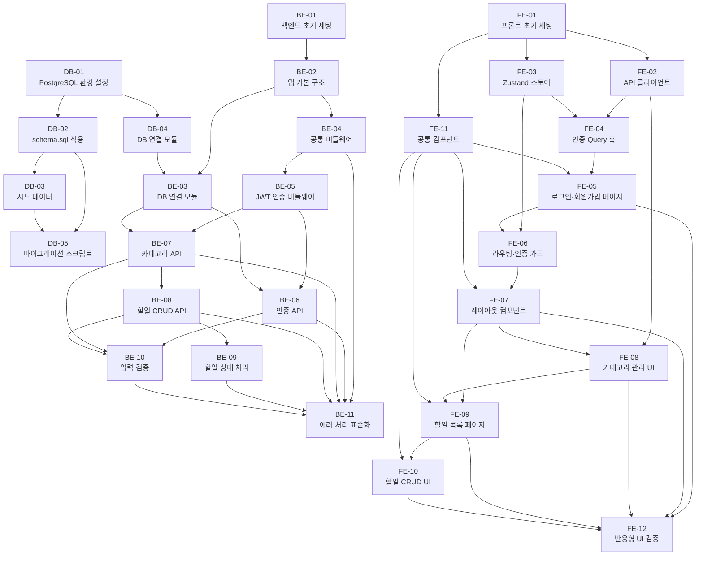

# 실행 계획서 - TodoList 애플리케이션

**버전:** 1.0
**작성일:** 2026-04-28
**참조 문서:**
- [도메인 정의서 v1.1](./1-domain-definition.md)
- [PRD v1.0](./2-prd.md)
- [프로젝트 구조 설계 원칙](./4-project-structure.md)
- [아키텍처 다이어그램](./5-arch-diagram.md)
- [ERD](./6-erd.md)

---

## 목차

1. [실행 개요](#1-실행-개요)
2. [태스크 의존성 그래프](#2-태스크-의존성-그래프)
3. [전체 태스크 요약](#3-전체-태스크-요약)
4. [일별 실행 계획](#4-일별-실행-계획)
5. [데이터베이스 태스크](#5-데이터베이스-태스크-db)
6. [백엔드 태스크](#6-백엔드-태스크-be)
7. [프론트엔드 태스크](#7-프론트엔드-태스크-fe)
8. [완료 기준 체크리스트](#8-완료-기준-체크리스트)
9. [변경 이력](#9-변경-이력)

---

## 1. 실행 개요

### 프로젝트 범위

| 구분 | 내용 |
|------|------|
| **기간** | 2026-04-28 ~ 2026-04-30 (3일, Phase 1 MVP) |
| **총 태스크 수** | 28개 (DB 5 / BE 11 / FE 12) |
| **총 예상 소요** | 약 29.5시간 (DB 3.5h + BE 12.5h + FE 13.5h) |
| **기술스택** | PostgreSQL / Node.js 24 + Express 5 / React 19 |
| **인증** | JWT HS-512 |
| **언어** | JavaScript (TypeScript 미사용, 전 레이어) |

### 태스크 ID 체계

| 접두사 | 도메인 | 태스크 수 |
|--------|--------|----------|
| `DB-XX` | 데이터베이스 | 5개 |
| `BE-XX` | 백엔드 (Node.js + Express) | 11개 |
| `FE-XX` | 프론트엔드 (React 19) | 12개 |

---

## 2. 태스크 의존성 그래프



---

## 3. 전체 태스크 요약

### 데이터베이스

| ID | 태스크 | 예상 소요 | 의존성 | 완료 |
|----|--------|----------|--------|------|
| DB-01 | 개발 환경 PostgreSQL 설정 | 0.5h | 없음 | - |
| DB-02 | schema.sql 작성 및 적용 | 1h | DB-01 | - |
| DB-03 | 시드 데이터 작성 | 0.5h | DB-02 | - |
| DB-04 | DB 연결 모듈 구현 (pg Pool) | 1h | DB-01 | - |
| DB-05 | 마이그레이션 스크립트 구조 | 0.5h | DB-02, DB-03 | - |
| | **소계** | **3.5h** | | |

### 백엔드

| ID | 태스크 | 예상 소요 | 의존성 | 완료 |
|----|--------|----------|--------|------|
| BE-01 | 프로젝트 초기 세팅 | 0.5h | 없음 | - |
| BE-02 | 앱 기본 구조 (app.js, server.js, config/, constants/) | 0.5h | BE-01 | - |
| BE-03 | DB 연결 모듈 (pg Pool) | 0.5h | BE-02, DB-04 | - |
| BE-04 | 공통 미들웨어 (CORS, 로깅, 에러핸들러) | 1h | BE-02 | - |
| BE-05 | JWT 인증 미들웨어 | 1h | BE-04 | - |
| BE-06 | 인증 API (register / login / logout / me) | 2h | BE-05, BE-03 | - |
| BE-07 | 카테고리 API (CRUD 4개) | 1.5h | BE-05, BE-03 | - |
| BE-08 | 할일 API — 기본 CRUD | 2h | BE-07 | - |
| BE-09 | 할일 API — 상태 처리 (complete / reopen / OVERDUE) | 1.5h | BE-08 | - |
| BE-10 | 입력 검증 레이어 | 1.5h | BE-06, BE-07, BE-08 | - |
| BE-11 | 에러 처리 표준화 | 1h | BE-04, BE-06~BE-10 | - |
| | **소계** | **13h** | | |

### 프론트엔드

| ID | 태스크 | 예상 소요 | 의존성 | 완료 |
|----|--------|----------|--------|------|
| FE-01 | 프로젝트 초기 세팅 (Vite + React 19 + Tailwind) | 0.5h | 없음 | - |
| FE-02 | API 클라이언트 (axios 인스턴스 + 인터셉터) | 0.5h | FE-01 | - |
| FE-03 | 인증 스토어 (Zustand authStore) | 0.5h | FE-01 | - |
| FE-04 | 인증 TanStack Query 훅 | 0.5h | FE-02, FE-03 | - |
| FE-05 | 로그인·회원가입 페이지 | 1.5h | FE-04, FE-11 | - |
| FE-06 | 라우팅 및 인증 가드 (PrivateRoute) | 0.5h | FE-03, FE-05 | - |
| FE-07 | 레이아웃 컴포넌트 (Header, Sidebar, MainContent) | 1.5h | FE-06, FE-11 | - |
| FE-08 | 카테고리 관리 UI | 1.5h | FE-02, FE-07 | - |
| FE-09 | 할일 목록 페이지 (필터, 상태 배지) | 2h | FE-07, FE-08, FE-11 | - |
| FE-10 | 할일 CRUD UI (생성·수정·삭제·완료 토글) | 2h | FE-09, FE-11 | - |
| FE-11 | 공통 컴포넌트 (Button, Input, Modal, Badge 등) | 1.5h | FE-01 | - |
| FE-12 | 반응형 UI 검증 (375px / 768px / 1280px) | 1h | FE-05, FE-07~FE-10 | - |
| | **소계** | **13h** | | |

---

## 4. 일별 실행 계획

### Day 1 — 2026-04-28 (기반 구축)

**목표:** DB 환경 완성, 백엔드/프론트엔드 프로젝트 초기화 및 인증 구현

| 순서 | 태스크 | 담당 레이어 | 예상 소요 |
|------|--------|-----------|----------|
| 1 | DB-01: PostgreSQL 환경 설정 | DB | 0.5h |
| 2 | DB-02: schema.sql 적용 | DB | 1h |
| 3 | DB-04: DB 연결 모듈 | DB | 1h |
| 4 | DB-03: 시드 데이터 | DB | 0.5h |
| 5 | DB-05: 마이그레이션 스크립트 | DB | 0.5h |
| 6 | BE-01: 백엔드 초기 세팅 | BE | 0.5h |
| 7 | BE-02: 앱 기본 구조 | BE | 0.5h |
| 8 | BE-03: DB 연결 모듈 | BE | 0.5h |
| 9 | BE-04: 공통 미들웨어 | BE | 1h |
| 10 | BE-05: JWT 인증 미들웨어 | BE | 1h |
| 11 | FE-01: 프론트엔드 초기 세팅 | FE | 0.5h |
| 12 | FE-11: 공통 컴포넌트 | FE | 1.5h |
| **합계** | | | **9h** |

**Day 1 완료 기준:**
- [ ] `psql -U todolist_user -d todolist_dev` 접속 및 3개 테이블 존재 확인
- [ ] `npm run db:test` 성공 (DB 연결 검증)
- [ ] `npm run dev` (백엔드) 서버 정상 기동
- [ ] `npm run dev` (프론트엔드) 브라우저 렌더링 확인
- [ ] 공통 컴포넌트 6종 렌더링 확인 (Button, Input, Modal, Badge, LoadingSpinner, EmptyState)

---

### Day 2 — 2026-04-29 (핵심 기능 구현)

**목표:** 인증 API + 카테고리·할일 CRUD API 완성, 프론트엔드 인증 및 레이아웃 완성

| 순서 | 태스크 | 담당 레이어 | 예상 소요 |
|------|--------|-----------|----------|
| 1 | BE-06: 인증 API | BE | 2h |
| 2 | BE-07: 카테고리 API | BE | 1.5h |
| 3 | BE-08: 할일 CRUD API | BE | 2h |
| 4 | FE-02: API 클라이언트 | FE | 0.5h |
| 5 | FE-03: Zustand 인증 스토어 | FE | 0.5h |
| 6 | FE-04: 인증 TanStack Query 훅 | FE | 0.5h |
| 7 | FE-05: 로그인·회원가입 페이지 | FE | 1.5h |
| 8 | FE-06: 라우팅·인증 가드 | FE | 0.5h |
| 9 | FE-07: 레이아웃 컴포넌트 | FE | 1.5h |
| **합계** | | | **10.5h** |

**Day 2 완료 기준:**
- [ ] `POST /api/auth/register` → 회원가입 성공, bcrypt 해시 저장 확인
- [ ] `POST /api/auth/login` → JWT 토큰 반환 확인
- [ ] `GET /api/categories` (JWT 없음) → 401 반환 확인
- [ ] 카테고리 CRUD 4개 엔드포인트 동작 확인
- [ ] 할일 CRUD 4개 엔드포인트 동작 확인
- [ ] 브라우저에서 로그인·회원가입 페이지 정상 동작
- [ ] 비인증 상태에서 `/` 접근 시 `/login` 리다이렉트 확인
- [ ] 데스크탑 기준 사이드바 + 메인 레이아웃 표시 확인

---

### Day 3 — 2026-04-30 (완성 및 검증)

**목표:** 할일 상태 처리 + 입력 검증 + 에러 처리 완성, 프론트엔드 전체 기능 완성 및 반응형 검증

| 순서 | 태스크 | 담당 레이어 | 예상 소요 |
|------|--------|-----------|----------|
| 1 | BE-09: 할일 상태 처리 (complete/reopen/OVERDUE) | BE | 1.5h |
| 2 | BE-10: 입력 검증 레이어 | BE | 1.5h |
| 3 | BE-11: 에러 처리 표준화 | BE | 1h |
| 4 | FE-08: 카테고리 관리 UI | FE | 1.5h |
| 5 | FE-09: 할일 목록 페이지 | FE | 2h |
| 6 | FE-10: 할일 CRUD UI | FE | 2h |
| 7 | FE-12: 반응형 UI 검증 | FE | 1h |
| **합계** | | | **10.5h** |

**Day 3 완료 기준:**
- [ ] `PATCH /api/tasks/:id/complete` → DB `COMPLETED` 저장, 응답 `status: COMPLETED` 확인
- [ ] `PATCH /api/tasks/:id/reopen` (마감일 과거 할일) → 응답 `status: OVERDUE` 확인 (BR-06)
- [ ] 이메일 형식 오류 시 `400 VALIDATION_ERROR` 반환 확인 (BR-10)
- [ ] 비밀번호 복잡도 미달 시 `400 VALIDATION_ERROR` 반환 확인 (BR-11)
- [ ] 모든 에러 응답이 `{ success: false, error: { code, message } }` 형식 준수
- [ ] 브라우저에서 할일 CRUD 전체 흐름 동작 확인
- [ ] OVERDUE 할일 빨간색 강조, COMPLETED 할일 취소선 표시 확인
- [ ] 모바일(375px) 레이아웃 정상 확인

---

## 5. 데이터베이스 태스크 [DB]

---

### DB-01: 개발 환경 PostgreSQL 설정

**설명:** 로컬 개발 환경에 PostgreSQL 데이터베이스를 생성하고, 애플리케이션 전용 사용자와 권한을 구성한다. `.env` 파일에 연결 정보를 기록한다.

**예상 소요:** 0.5h
**의존성:** 없음

#### 작업 체크리스트

- [ ] PostgreSQL 설치 여부 확인 (`psql --version`, PostgreSQL 12+ 요구)
- [ ] `todolist_dev` 데이터베이스 생성 (`CREATE DATABASE todolist_dev;`)
- [ ] 애플리케이션 전용 DB 사용자 생성 (`CREATE USER todolist_user WITH PASSWORD '...';`)
- [ ] 해당 사용자에게 `todolist_dev` 전체 권한 부여 (`GRANT ALL PRIVILEGES ...`)
- [ ] `.env` 파일 생성 및 항목 추가
  ```
  DB_HOST=localhost
  DB_PORT=5432
  DB_NAME=todolist_dev
  DB_USER=todolist_user
  DB_PASSWORD=<설정한_비밀번호>
  DB_POOL_MAX=10
  DB_POOL_IDLE_TIMEOUT=30000
  DB_POOL_CONNECTION_TIMEOUT=2000
  ```
- [ ] `.env`가 `.gitignore`에 포함되어 있는지 확인
- [ ] `.env.example` 파일에 키 목록만 기록 (팀 공유용)
- [ ] `psql -U todolist_user -d todolist_dev` 명령으로 로컬 접속 성공 확인

#### 완료 조건

- [ ] `todolist_dev` 데이터베이스가 PostgreSQL에 정상 존재함
- [ ] `todolist_user` 계정으로 `todolist_dev`에 접속 및 DDL 실행이 가능함
- [ ] `.env` 파일에 DB 접속 정보 7개 항목이 모두 기록됨
- [ ] `.env`가 `.gitignore`에 명시되어 버전 관리에서 제외됨
- [ ] `.env.example`에 실제 비밀 값 없이 키만 존재함

---

### DB-02: schema.sql 작성 및 적용

**설명:** `database/schema.sql`(초안 존재)을 ERD(`docs/6-erd.md`) 기준으로 검토·보완한 후 개발 DB에 적용한다. 3개 테이블, 모든 제약 조건, 6개 인덱스(Partial Index 포함)를 포함해야 한다.

**예상 소요:** 1h
**의존성:** DB-01 완료

#### 작업 체크리스트

- [ ] `database/schema.sql` 내용 검토 — ERD 명세와 불일치 항목 확인
- [ ] `users` 테이블 DDL 확인 및 보완
  - [ ] `id SERIAL PRIMARY KEY`
  - [ ] `email VARCHAR(255) NOT NULL UNIQUE` (BR-02)
  - [ ] `password TEXT NOT NULL` — 주석으로 bcrypt 해시 전용 명시 (BR-03)
  - [ ] `created_at TIMESTAMPTZ NOT NULL DEFAULT NOW()`
- [ ] `categories` 테이블 DDL 확인 및 보완
  - [ ] `user_id INTEGER NOT NULL REFERENCES users(id) ON DELETE CASCADE`
  - [ ] `name VARCHAR(100) NOT NULL`
  - [ ] `CONSTRAINT uk_categories_user_name UNIQUE(user_id, name)` (BR-04)
- [ ] `tasks` 테이블 DDL 확인 및 보완
  - [ ] `category_id INTEGER REFERENCES categories(id) ON DELETE SET NULL` (BR-05)
  - [ ] `status VARCHAR(20) NOT NULL DEFAULT 'PENDING' CHECK (status IN ('PENDING', 'COMPLETED'))` (BR-06)
  - [ ] `due_date TIMESTAMPTZ` — NULL 허용 (BR-08)
- [ ] 6개 인덱스 DDL 확인
  - [ ] `idx_users_email`, `idx_categories_user_id`, `idx_tasks_user_id`
  - [ ] `idx_tasks_category_id`, `idx_tasks_user_status`
  - [ ] `idx_tasks_due_date ON tasks(due_date) WHERE status = 'PENDING'` — Partial Index
- [ ] `psql -U todolist_user -d todolist_dev -f database/schema.sql` 명령으로 적용

#### 완료 조건

- [ ] `todolist_dev`에 `users`, `categories`, `tasks` 3개 테이블이 모두 존재함
- [ ] `information_schema.table_constraints` 조회 시 PK 3개, UNIQUE 2개, CHECK 1개 확인됨
- [ ] FK 3개가 ON DELETE 정책(CASCADE / SET NULL)과 함께 존재함
- [ ] `pg_indexes` 조회 시 6개 인덱스 모두 존재, Partial Index 확인됨
- [ ] `schema.sql`을 2회 연속 실행해도 오류 없이 성공함 (DROP IF EXISTS 보장)

---

### DB-03: 시드 데이터 작성

**설명:** `database/seed.sql`을 작성한다. 사용자 2명, 카테고리 3개, 할일 10개를 삽입하며, OVERDUE 판별·미분류·경계값 등 7가지 시나리오를 망라한다.

**예상 소요:** 0.5h
**의존성:** DB-02 완료

#### 작업 체크리스트

- [ ] `database/seed.sql` 파일 신규 생성
- [ ] 트랜잭션 블록 (`BEGIN;` / `COMMIT;`) 적용
- [ ] 사용자 2명 삽입 (비밀번호는 bcrypt 해시값)
  - [ ] `user1@example.com` / 평문 `Test1234!` 해시
  - [ ] `user2@example.com` / 평문 `Test1234!` 해시
- [ ] 카테고리 3개 삽입 (user1: 업무·개인, user2: 학습)
- [ ] 할일 10개 삽입 — 아래 시나리오 모두 포함
  - [ ] PENDING + 미래 due_date (정상 PENDING)
  - [ ] PENDING + 과거 due_date (OVERDUE 판별 대상) × 2건 이상
  - [ ] COMPLETED + due_date 있음
  - [ ] category_id NULL + due_date NULL (미분류, 기한 없음)
  - [ ] category_id NULL + 과거 due_date (OVERDUE 판별 대상)
  - [ ] PENDING + 오늘 자정 due_date (경계값)
- [ ] 삽입 후 검증 쿼리 주석 블록 추가

#### 완료 조건

- [ ] `seed.sql` 실행 후 `users` 2행, `categories` 3행, `tasks` 10행 존재함
- [ ] `status = 'PENDING' AND due_date < NOW()` 조건으로 3건 이상 반환됨
- [ ] `category_id IS NULL` 조건으로 2건 이상 반환됨
- [ ] `seed.sql`을 2회 연속 실행해도 UNIQUE 위반 없이 성공함 (ON CONFLICT 처리)
- [ ] 두 사용자의 데이터가 서로의 `user_id`를 침범하지 않음 (BR-09)

---

### DB-04: DB 연결 모듈 구현 (pg Pool)

**설명:** `pg` 라이브러리의 `Pool`을 사용하는 DB 연결 모듈을 구현한다. `.env` 기반 연결, 연결 성공/실패 로그, 종료 훅, 연결 테스트 스크립트를 포함한다.

**예상 소요:** 1h
**의존성:** DB-01 완료

#### 작업 체크리스트

- [ ] `pg`, `dotenv` 패키지 설치 여부 확인
- [ ] `src/db/pool.js` 파일 작성
  - [ ] `pg.Pool` 인스턴스를 `.env` 변수로 생성
  - [ ] Pool `connect` 이벤트 리스너 — 최초 연결 성공 시 로그
  - [ ] Pool `error` 이벤트 리스너 — 유휴 클라이언트 오류 처리
  - [ ] `query(text, params)` 래퍼 함수 export
  - [ ] `getClient()` 함수 export (트랜잭션용)
  - [ ] Pool 인스턴스 named export
- [ ] `src/db/index.js` 작성 — 단일 진입점 재-export
- [ ] 연결 테스트 스크립트 `src/db/testConnection.js` 작성
  - [ ] `SELECT NOW()` 실행 후 결과 출력
  - [ ] 실패 시 `process.exit(1)` 종료
- [ ] `package.json`에 `"db:test"` 스크립트 추가

#### 완료 조건

- [ ] `npm run db:test` 실행 시 현재 UTC 시각이 출력되고 정상 종료됨
- [ ] 잘못된 DB 접속 정보 설정 시 명확한 오류 메시지와 함께 `exit(1)` 종료됨
- [ ] `pool.js`가 `query`, `getClient`, `pool` 3가지를 export함
- [ ] Pool 설정에 `max`, `idleTimeoutMillis`, `connectionTimeoutMillis`가 환경변수에서 읽힘
- [ ] `pool.js` 내 하드코딩된 DB 접속 정보가 없음

---

### DB-05: 마이그레이션 스크립트 구조 설계

**설명:** `database/reset.sql`을 작성하고 `package.json`에 4개 npm 스크립트(`db:reset`, `db:schema`, `db:seed`, `db:migrate`)를 등록하여 단계별·전체 초기화가 가능한 구조를 완성한다.

**예상 소요:** 0.5h
**의존성:** DB-02, DB-03 완료

#### 작업 체크리스트

- [ ] `database/reset.sql` 파일 작성
  - [ ] FK 역순 DROP: `tasks` → `categories` → `users`
  - [ ] `DROP TABLE IF EXISTS ... CASCADE`
  - [ ] 파일 상단 "운영 환경 실행 금지" 경고 주석
- [ ] `package.json` scripts에 4개 스크립트 추가
  - [ ] `"db:reset"` — `reset.sql` 실행
  - [ ] `"db:schema"` — `schema.sql` 실행
  - [ ] `"db:seed"` — `seed.sql` 실행
  - [ ] `"db:migrate"` — reset → schema → seed 순서 일괄 실행
- [ ] 각 SQL 파일 상단에 목적·실행 순서 주석 기록

#### 완료 조건

- [ ] `database/` 아래 `reset.sql`, `schema.sql`, `seed.sql` 3개 파일 존재
- [ ] `reset.sql` 실행 시 3개 테이블 삭제, 오류 없음
- [ ] `package.json`에 4개 스크립트 정의됨
- [ ] `db:migrate` 실행 시 DB 초기화 + 시드 데이터 10건 자동 삽입됨
- [ ] `db:migrate` 2회 연속 실행해도 오류 없음 (멱등성 보장)

---

## 6. 백엔드 태스크 [BE]

---

### BE-01: 프로젝트 초기 세팅

**설명:** `backend/` 디렉토리의 Node.js 프로젝트를 초기화하고 핵심 의존성을 설치한다.

**예상 소요:** 0.5h
**의존성:** 없음

#### 작업 체크리스트

- [ ] `backend/` 디렉토리 생성 및 `npm init` 실행
- [ ] `package.json`에 `"type": "module"` 설정 (ESM 방식)
- [ ] 프로덕션 의존성 설치: `express@5`, `pg`, `bcrypt`, `jsonwebtoken`, `cors`, `dotenv`
- [ ] 개발 의존성 설치: `nodemon`
- [ ] `package.json` scripts: `"start"`, `"dev"` (nodemon) 정의
- [ ] `.env.example` 생성: `PORT`, `DB_HOST`, `DB_PORT`, `DB_NAME`, `DB_USER`, `DB_PASSWORD`, `JWT_SECRET`, `JWT_EXPIRES_IN`
- [ ] `.gitignore`에 `node_modules/`, `.env` 추가 확인
- [ ] `backend/.env` 파일 생성 (로컬 개발용)

#### 완료 조건

- [ ] `npm run dev` 실행 시 오류 없이 nodemon 기동됨
- [ ] `package.json`에 모든 필수 의존성이 명시되어 있음
- [ ] `.env.example`에 필요한 모든 환경변수 키가 정의되어 있음

---

### BE-02: 앱 기본 구조 (app.js, server.js, config/, constants/)

**설명:** Express 진입점(`app.js`, `server.js`)과 전역 설정 모듈(`config/`), 공통 상수 모듈(`constants/`)을 구성한다.

**예상 소요:** 0.5h
**의존성:** BE-01 완료

#### 작업 체크리스트

- [ ] `src/` 하위 디렉토리 구조 생성: `routes/`, `controllers/`, `services/`, `repositories/`, `middlewares/`, `utils/`, `constants/`, `config/`
- [ ] `app.js` 작성: Express 앱 생성, 미들웨어 등록, 라우터 마운트, 에러핸들러 등록
- [ ] `server.js` 작성: `app.js` import 후 `app.listen()`, `PORT` 환경변수 참조
- [ ] `src/config/index.js` 작성: `dotenv` 로드 및 설정 값 객체 export
- [ ] `src/constants/httpStatus.js` 작성: HTTP 상태코드 상수 정의
- [ ] `src/constants/errorCodes.js` 작성: 도메인별 에러코드 문자열 상수 정의

#### 완료 조건

- [ ] `node server.js` 실행 시 지정 포트에서 서버가 정상 기동됨
- [ ] `config/index.js`가 `.env` 파일의 모든 환경변수를 객체로 제공함
- [ ] `constants/` 모듈이 에러코드와 HTTP 상태코드를 중앙 관리함

---

### BE-03: DB 연결 모듈 (pg Pool 설정)

**설명:** `pg Pool`을 이용해 PostgreSQL 커넥션 풀을 설정하고 쿼리 실행 헬퍼 함수를 제공한다. 연결 실패 시 서버 기동을 중단하는 헬스체크 로직을 포함한다.

**예상 소요:** 0.5h
**의존성:** BE-02 완료, DB-04 완료

#### 작업 체크리스트

- [ ] `src/config/db.js` 작성: `pg.Pool` 인스턴스 생성
- [ ] Pool 설정: `max`, `idleTimeoutMillis`, `connectionTimeoutMillis`
- [ ] `query(text, params)` 헬퍼 함수 export (파라미터화 쿼리 전용)
- [ ] `getClient()` 함수 export (트랜잭션 처리용)
- [ ] 서버 시작 시 `pool.connect()` 테스트, 실패 시 프로세스 종료
- [ ] Pool 에러 이벤트 핸들러 등록 (`pool.on('error', ...)`)

#### 완료 조건

- [ ] 서버 기동 시 PostgreSQL 연결 성공 로그 출력됨
- [ ] DB 접속 정보 오류 시 명확한 오류 메시지와 함께 서버 종료됨
- [ ] 모든 Repository에서 동일한 `query()` 헬퍼를 통해 파라미터화 쿼리만 사용함

---

### BE-04: 공통 미들웨어 (CORS, 로깅, 에러핸들러)

**설명:** 모든 요청에 공통 적용되는 CORS, JSON 파싱, 요청 로깅, 전역 에러핸들러를 구현한다.

**예상 소요:** 1h
**의존성:** BE-02 완료

#### 작업 체크리스트

- [ ] `src/middlewares/cors.js` 작성: 허용 Origin, 메서드, 헤더 설정
- [ ] `app.js`에 `express.json()` 바디파서 등록 (크기 제한: 1mb)
- [ ] `src/middlewares/requestLogger.js` 작성: method, url, ip, 소요 시간, 상태코드 출력
- [ ] `src/middlewares/errorHandler.js` 작성 (4-인자 Express 에러핸들러)
  - [ ] `statusCode`, `code`, `message` 추출
  - [ ] 표준 응답 형식: `{ "success": false, "error": { "code": "...", "message": "..." } }`
  - [ ] 처리되지 않은 예외는 `INTERNAL_SERVER_ERROR` / 500
  - [ ] 개발 환경에서만 스택 트레이스 포함
- [ ] `src/utils/AppError.js` 작성: `statusCode`, `code`를 가진 커스텀 에러 클래스
- [ ] `app.js` 미들웨어 등록 순서: cors → json → 요청 로거 → 라우터 → 에러핸들러

#### 완료 조건

- [ ] 존재하지 않는 엔드포인트 요청 시 표준 에러 형식 응답됨
- [ ] 서비스 내부 예외 발생 시 클라이언트에 스택 트레이스가 노출되지 않음
- [ ] 모든 요청의 method, url, 상태코드, 소요시간이 콘솔에 기록됨

---

### BE-05: JWT 인증 미들웨어

**설명:** Bearer 토큰을 검증하고 `req.user`에 사용자 정보를 주입하는 인증 미들웨어를 구현한다. (BR-01)

**예상 소요:** 1h
**의존성:** BE-04 완료

#### 작업 체크리스트

- [ ] `src/middlewares/authenticate.js` 작성
  - [ ] `Authorization: Bearer <token>` 헤더 파싱
  - [ ] 헤더 없거나 Bearer 스킴이 아닌 경우 → `401 / MISSING_TOKEN`
  - [ ] `jsonwebtoken.verify(token, secret, { algorithms: ['HS512'] })`
  - [ ] 토큰 만료 시 → `401 / TOKEN_EXPIRED`
  - [ ] 서명 불일치 시 → `401 / INVALID_TOKEN`
  - [ ] 검증 성공 시 `req.user = { userId, email }` 주입 후 `next()`
- [ ] `src/config/index.js`에 JWT 설정 추가: `jwtSecret`, `jwtExpiresIn`
- [ ] 인증이 필요한 라우터 그룹에만 미들웨어 적용 구조 확인 (`/register`, `/login` 제외)

#### 완료 조건

- [ ] 유효한 토큰 없이 보호된 엔드포인트 접근 시 `401` 응답됨
- [ ] 만료된 토큰과 잘못된 토큰에 대해 각각 다른 에러코드로 구분됨
- [ ] 유효한 토큰 요청 시 `req.user.userId`가 정수 타입으로 정확히 주입됨
- [ ] HS-512 알고리즘 이외의 토큰은 거부됨

---

### BE-06: 인증 API (register / login / logout / me)

**설명:** 회원가입(bcrypt 해시·이메일 중복 방지), 로그인(JWT HS-512 발급), 로그아웃, 내 정보 조회 4개 엔드포인트를 Route → Controller → Service → Repository로 분리 구현한다.

**예상 소요:** 2h
**의존성:** BE-05, BE-03 완료

#### 작업 체크리스트

**Repository (`src/repositories/userRepository.js`)**
- [ ] `findByEmail(email)`: 이메일로 사용자 조회
- [ ] `findById(id)`: id로 조회 (비밀번호 제외)
- [ ] `create({ email, hashedPassword })`: 신규 사용자 INSERT

**Service (`src/services/authService.js`)**
- [ ] `register`: 이메일 중복 검사(BR-02) → bcrypt 해시(saltRounds: 12) → create
- [ ] `login`: 사용자 조회 → bcrypt.compare → JWT HS-512 발급
- [ ] `getMe`: findById 호출

**Controller (`src/controllers/authController.js`)**
- [ ] `register`: 201 응답
- [ ] `login`: 200 + `{ token, user }` 응답
- [ ] `logout`: 200 응답 (클라이언트 토큰 폐기 책임)
- [ ] `me`: 200 + 사용자 정보 응답 (비밀번호 필드 제외)

**Route (`src/routes/auth.js`)**
- [ ] `POST /api/auth/register`, `POST /api/auth/login` (미들웨어 미적용)
- [ ] `POST /api/auth/logout`, `GET /api/auth/me` (authenticate 적용)

#### 완료 조건

- [ ] 신규 이메일로 회원가입 시 `201` 응답, 비밀번호 bcrypt 해시 저장 확인
- [ ] 동일 이메일 재가입 시 `409 / DUPLICATE_EMAIL` 응답됨 (BR-02)
- [ ] 올바른 자격증명으로 로그인 시 JWT 토큰 반환됨
- [ ] 잘못된 비밀번호 로그인 시 `401 / INVALID_CREDENTIALS` 응답됨
- [ ] `GET /api/auth/me` 응답에 `password` 필드가 포함되지 않음

---

### BE-07: 카테고리 API (CRUD 4개 엔드포인트)

**설명:** 사용자별 카테고리명 중복 방지(BR-04), 삭제 시 tasks.category_id SET NULL(BR-05), 데이터 격리(BR-09)를 적용한 CRUD 4개 엔드포인트를 구현한다.

**예상 소요:** 1.5h
**의존성:** BE-05, BE-03 완료

#### 작업 체크리스트

**Repository (`src/repositories/categoryRepository.js`)**
- [ ] `findAllByUserId(userId)`: 사용자 카테고리 목록
- [ ] `findByIdAndUserId(id, userId)`: 소유권 검증 내장 단건 조회
- [ ] `findByNameAndUserId(name, userId)`: 중복 검사용
- [ ] `create({ userId, name })`, `update({ id, userId, name })`, `delete(id, userId)`

**Service (`src/services/categoryService.js`)**
- [ ] `createCategory`: 이름 중복 검사(BR-04) → create
- [ ] `updateCategory`: 소유권 검증 → 이름 중복 검사(자기 자신 제외) → update
- [ ] `deleteCategory`: 소유권 검증 → delete (SET NULL은 DB FK 자동 처리)

**Route (`src/routes/categories.js`)**
- [ ] 라우터 전체에 `authenticate` 적용
- [ ] `GET/POST /api/categories`, `PUT/DELETE /api/categories/:id`

#### 완료 조건

- [ ] 타 사용자 카테고리 수정/삭제 시 `404` 응답됨 (존재 여부 미노출)
- [ ] 동일 사용자 내 카테고리명 중복 생성 시 `409 / DUPLICATE_CATEGORY` 응답됨
- [ ] 카테고리 삭제 후 해당 카테고리 할일의 `category_id`가 `null`로 변경됨 (BR-05)

---

### BE-08: 할일 API — 기본 CRUD

**설명:** 할일 목록 조회(카테고리·상태 필터), 생성, 수정, 삭제 엔드포인트를 구현한다. 모든 쿼리에 `user_id` 조건 포함(BR-09).

**예상 소요:** 2h
**의존성:** BE-07 완료

#### 작업 체크리스트

**Repository (`src/repositories/taskRepository.js`)**
- [ ] `findAllByUserId({ userId, categoryId, status })`: 필터 조건 포함 목록 조회
- [ ] `findByIdAndUserId(id, userId)`: 소유권 검증 단건 조회
- [ ] `create(...)`, `update(...)`, `delete(id, userId)`

**Service (`src/services/taskService.js`)**
- [ ] `getTasks`: DB 조회 결과에 `enrichTaskStatus()` 적용, OVERDUE 필터는 서비스에서 처리
- [ ] `enrichTaskStatus(task)`: 상태 실시간 계산 stub (BE-09에서 완성)
- [ ] `createTask`, `updateTask`, `deleteTask`: 소유권 검증 + 카테고리 소유권 검증 포함

**Route (`src/routes/tasks.js`)**
- [ ] 라우터 전체에 `authenticate` 적용
- [ ] `GET/POST /api/tasks`, `PUT/DELETE /api/tasks/:id`

#### 완료 조건

- [ ] `GET /api/tasks?status=OVERDUE` 요청 시 실시간 계산 기반 OVERDUE 할일만 반환됨
- [ ] `GET /api/tasks?categoryId=1` 타인 카테고리 사용 시 `403` 응답됨
- [ ] 타 사용자 할일 수정/삭제 시 `404` 응답됨
- [ ] 응답 할일 객체에 실시간 계산된 상태값이 포함됨

---

### BE-09: 할일 API — 상태 처리 (complete / reopen / OVERDUE 실시간 판별)

**설명:** 완료 처리(`PATCH complete`)와 미완료 복구(`PATCH reopen`) 엔드포인트를 구현하고, `enrichTaskStatus()` 핵심 비즈니스 로직(BR-06/07/08)을 완성한다.

**예상 소요:** 1.5h
**의존성:** BE-08 완료

#### 작업 체크리스트

**Repository 추가**
- [ ] `updateStatus({ id, userId, status })`: status + updated_at 업데이트

**Service — OVERDUE 실시간 판별 (`enrichTaskStatus` 완성)**
- [ ] `task.status === 'COMPLETED'` → `'COMPLETED'` 반환 (BR-07 우선)
- [ ] `task.due_date === null` → `'PENDING'` 반환 (BR-08)
- [ ] `new Date(task.due_date) < new Date() && task.status === 'PENDING'` → `'OVERDUE'` (BR-06)
- [ ] 그 외 → `'PENDING'` 반환
- [ ] `completeTask`: 소유권 검증 → updateStatus('COMPLETED') → enrichTaskStatus 적용
- [ ] `reopenTask`: 소유권 검증 → updateStatus('PENDING') → enrichTaskStatus 적용

**Route 추가**
- [ ] `PATCH /api/tasks/:id/complete`, `PATCH /api/tasks/:id/reopen`

#### 완료 조건

- [ ] `PATCH complete` 성공 시 DB `COMPLETED` 저장, 응답 `status: COMPLETED` 확인
- [ ] 마감일 과거 할일 reopen 시 응답 `status: OVERDUE` 반환됨 (BR-06)
- [ ] 완료된 할일은 마감일 초과 여부 무관하게 `COMPLETED` 유지됨 (BR-07)
- [ ] `due_date`가 `null`인 할일은 절대 `OVERDUE`가 되지 않음 (BR-08)
- [ ] `PATCH complete`를 이미 완료된 할일에 재호출 시 에러 없이 `200` 응답 (멱등성)

---

### BE-10: 입력 검증 레이어

**설명:** 이메일 형식(BR-10), 비밀번호 복잡도(BR-11), 각 API 필수 필드를 검증하고, 검증 실패 시 `400 VALIDATION_ERROR` 표준 응답을 반환한다.

**예상 소요:** 1.5h
**의존성:** BE-06, BE-07, BE-08 완료

#### 작업 체크리스트

**공통 유틸 (`src/utils/validators.js`)**
- [ ] `isValidEmail(email)`: RFC 5322 기반 정규식 (BR-10)
- [ ] `isValidPassword(password)`: 최소 8자, 영문+숫자+특수문자 (BR-11)
- [ ] `isNonEmptyString(value)`, `isPositiveInteger(value)`

**각 API 검증 적용**
- [ ] `POST /api/auth/register`: email 형식(BR-10) + password 복잡도(BR-11)
- [ ] `POST /api/auth/login`: email·password 필수
- [ ] `POST /api/categories`: name 필수 + 최대 100자
- [ ] `PUT /api/categories/:id`: name 필수 + :id 양의 정수
- [ ] `POST /api/tasks`: title 필수 + 최대 255자, dueDate ISO 8601 형식
- [ ] `PUT /api/tasks/:id`: 각 필드 존재 시 형식 검증, :id 양의 정수
- [ ] `PATCH /api/tasks/:id/complete|reopen`: :id 양의 정수

#### 완료 조건

- [ ] `password: "abc"` 회원가입 시 `400 / VALIDATION_ERROR` 응답됨 (BR-11)
- [ ] `email: "notanemail"` 회원가입 시 `400 / VALIDATION_ERROR` 응답됨 (BR-10)
- [ ] `title` 없이 할일 생성 시 `400 / VALIDATION_ERROR` 응답됨
- [ ] `:id`에 문자열·음수 전달 시 `400 / VALIDATION_ERROR` 응답됨
- [ ] 에러 메시지에서 어떤 필드가 문제인지 식별 가능함

---

### BE-11: 에러 처리 표준화

**설명:** 에러코드 상수를 완성하고, `AppError` 팩토리 메서드와 전역 에러핸들러를 완성한다. pg 라이브러리 에러(UNIQUE 위반 등)를 도메인 에러코드로 변환한다.

**예상 소요:** 1h
**의존성:** BE-04, BE-06~BE-10 완료

#### 작업 체크리스트

**에러코드 상수 완성 (`src/constants/errorCodes.js`)**
- [ ] 인증: `MISSING_TOKEN`, `INVALID_TOKEN`, `TOKEN_EXPIRED`, `INVALID_CREDENTIALS`, `DUPLICATE_EMAIL`, `USER_NOT_FOUND`
- [ ] 카테고리: `CATEGORY_NOT_FOUND`, `DUPLICATE_CATEGORY`
- [ ] 할일: `TASK_NOT_FOUND`
- [ ] 공통: `VALIDATION_ERROR`, `NOT_FOUND`, `FORBIDDEN`, `INTERNAL_SERVER_ERROR`

**AppError 클래스 완성**
- [ ] 생성자: `statusCode`, `code`, `message`, `isOperational: true`
- [ ] 팩토리 메서드: `notFound`, `forbidden`, `conflict`, `unauthorized`, `badRequest`

**전역 에러핸들러 완성**
- [ ] `isOperational === true`: `statusCode`, `code`, `message` 그대로 사용
- [ ] `pg` UNIQUE 위반(`23505`) → `409` + 도메인 에러코드 변환
- [ ] `JsonWebTokenError` → `401 / INVALID_TOKEN`
- [ ] `TokenExpiredError` → `401 / TOKEN_EXPIRED`
- [ ] 예측 불가 에러 → `500 / INTERNAL_SERVER_ERROR` (개발 환경에서만 스택 로그)

#### 완료 조건

- [ ] 모든 에러 응답이 `{ "success": false, "error": { "code": "...", "message": "..." } }` 형식 준수
- [ ] 예측 불가 에러에서 DB 쿼리문·스택 트레이스가 클라이언트에 노출되지 않음
- [ ] pg UNIQUE 위반이 도메인 에러코드로 변환되어 응답됨
- [ ] 개발 환경(`NODE_ENV=development`)에서 서버 로그에 스택 트레이스 출력됨
- [ ] `AppError` 팩토리 메서드를 통해 서비스 전체에서 일관된 에러 생성됨

---

## 7. 프론트엔드 태스크 [FE]

---

### FE-01: 프로젝트 초기 세팅

**설명:** Vite 기반 React 19 프로젝트를 생성하고, Tailwind CSS, TanStack Query, Zustand, React Router, axios를 설치 및 설정한다. `frontend/` 디렉토리 구조를 완성한다.

**예상 소요:** 0.5h
**의존성:** 없음

#### 작업 체크리스트

- [ ] `npm create vite@latest frontend -- --template react`
- [ ] 필수 패키지 설치: `@tanstack/react-query`, `zustand`, `react-router-dom`, `axios`
- [ ] Tailwind CSS v3 설치 및 `tailwind.config.js`, `postcss.config.js` 설정
- [ ] `src/` 하위 디렉토리 생성: `api/`, `components/`, `pages/`, `hooks/`, `store/`, `utils/`, `constants/`, `styles/`
- [ ] `styles/index.css`에 Tailwind 디렉티브 추가
- [ ] `main.jsx`에 `QueryClientProvider`, `BrowserRouter` 래핑 설정
- [ ] Vite 경로 별칭 `@/` → `src/` 설정 (`vite.config.js`)
- [ ] `.env.example` 생성 (`VITE_API_BASE_URL`)
- [ ] 불필요한 Vite 기본 파일 정리

#### 완료 조건

- [ ] `npm run dev` 실행 시 브라우저에서 빈 앱 정상 렌더링됨
- [ ] Tailwind 유틸리티 클래스가 빌드 결과에 정상 포함됨
- [ ] 환경 변수로 API Base URL이 분리됨

---

### FE-02: API 클라이언트 (axios 인스턴스 + 인터셉터)

**설명:** JWT 헤더 자동 첨부, 401 시 자동 로그아웃·리다이렉트, 도메인별 API 함수를 구성한다.

**예상 소요:** 0.5h
**의존성:** FE-01 완료

#### 작업 체크리스트

- [ ] `src/api/index.js`: axios 인스턴스 생성 (`baseURL`, `timeout`)
- [ ] 요청 인터셉터: `localStorage`에서 토큰 읽어 `Authorization: Bearer` 헤더 자동 첨부
- [ ] 응답 인터셉터: 401 수신 시 토큰 제거 → `/login` 리다이렉트, 403은 reject 전달
- [ ] `src/api/auth.js`: `loginUser`, `registerUser`, `getMe`
- [ ] `src/api/categories.js`: `getCategories`, `createCategory`, `updateCategory`, `deleteCategory`
- [ ] `src/api/tasks.js`: `getTasks`, `createTask`, `updateTask`, `deleteTask`, `completeTask`, `uncompleteTask`
- [ ] 각 API 함수에서 `response.data`만 반환

#### 완료 조건

- [ ] 토큰 있을 때 모든 요청에 `Authorization` 헤더가 자동 포함됨
- [ ] 401 응답 수신 시 `/login`으로 자동 이동됨
- [ ] API 함수 호출 시 불필요한 `.data` 체이닝 없이 데이터 사용 가능

---

### FE-03: 인증 스토어 (Zustand authStore)

**설명:** `token`, `user` 전역 인증 상태와 `login`, `logout`, `setUser` 액션을 관리한다. 토큰을 `localStorage`에 영속화한다.

**예상 소요:** 0.5h
**의존성:** FE-01 완료

#### 작업 체크리스트

- [ ] `src/store/authStore.js` 생성
- [ ] 상태: `token`(string|null), `user`(object|null), `isAuthenticated`(boolean)
- [ ] `login(token, user)`: 상태 업데이트 + `localStorage.setItem`
- [ ] `logout()`: 상태 초기화 + `localStorage.removeItem`
- [ ] `setUser(user)`: 유저 정보 업데이트
- [ ] 초기화 시 `localStorage.getItem('token')`으로 기존 토큰 복원

#### 완료 조건

- [ ] 페이지 새로고침 후에도 로그인 상태 유지됨
- [ ] `logout()` 후 스토어와 `localStorage` 모두 초기화됨
- [ ] 여러 컴포넌트에서 `useAuthStore()` 훅으로 동일 상태 공유 가능

---

### FE-04: 인증 TanStack Query 훅

**설명:** `useLogin`, `useRegister`, `useMe`, `useLogout` 훅을 구현한다. Mutation 성공 시 Zustand 스토어를 업데이트한다.

**예상 소요:** 0.5h
**의존성:** FE-02, FE-03 완료

#### 작업 체크리스트

- [ ] `src/hooks/useAuth.js` 생성
- [ ] `useLogin()`: `useMutation` → 성공 시 `authStore.login()` + `/` 네비게이트
- [ ] `useRegister()`: `useMutation` → 성공 시 `/login` 네비게이트
- [ ] `useMe()`: `useQuery` → `enabled: isAuthenticated`, 성공 시 `authStore.setUser()`
- [ ] `useLogout()`: `authStore.logout()` + `queryClient.clear()` + `/login` 네비게이트
- [ ] `onError`에서 서버 응답 에러 메시지 파싱하여 반환

#### 완료 조건

- [ ] 로그인 성공 시 메인 페이지(`/`)로 자동 이동됨
- [ ] 회원가입 성공 시 로그인 페이지(`/login`)로 자동 이동됨
- [ ] 인증 상태에서 앱 로드 시 `useMe`가 자동으로 유저 정보 갱신함
- [ ] 로그아웃 후 TanStack Query 캐시가 초기화됨

---

### FE-05: 로그인·회원가입 페이지

**설명:** `/login`과 `/register` 페이지를 구현한다. 클라이언트 유효성 검사, 서버 에러 메시지, 로딩 상태, 반응형 레이아웃을 포함한다.

**예상 소요:** 1.5h
**의존성:** FE-04, FE-11 완료

#### 작업 체크리스트

- [ ] `src/pages/LoginPage.jsx` 생성
  - [ ] 이메일·비밀번호 입력 필드 (공통 `Input` 컴포넌트)
  - [ ] 이메일 형식·비밀번호 최소 8자 유효성 검사
  - [ ] `useLogin()` 뮤테이션 호출
  - [ ] 로딩 중 버튼 `disabled` + 스피너
  - [ ] 서버 에러 메시지 폼 하단 빨간 텍스트로 표시
  - [ ] "회원가입" 링크 (`/register`)
- [ ] `src/pages/RegisterPage.jsx` 생성
  - [ ] 이메일·비밀번호·비밀번호 확인 입력 필드
  - [ ] 비밀번호 복잡도 + 비밀번호 확인 일치 검사 (FR-AUTH-03)
  - [ ] `useRegister()` 뮤테이션 호출
  - [ ] 서버 에러 메시지 표시
  - [ ] "로그인" 링크 (`/login`)
- [ ] 이미 로그인 상태에서 `/login` 접근 시 `/` 리다이렉트

#### 완료 조건

- [ ] 유효하지 않은 이메일 형식 시 필드 에러 메시지 표시됨
- [ ] 비밀번호 조건 미충족 시 에러 메시지 표시됨
- [ ] 서버 에러(이메일 중복, 잘못된 인증 정보)가 UI에 노출됨
- [ ] 로딩 중 중복 제출 방지됨
- [ ] 모바일(375px)에서 폼이 정상 표시됨

---

### FE-06: 라우팅 및 인증 가드 (PrivateRoute)

**설명:** React Router v6으로 앱 전체 라우트를 구성하고, `PrivateRoute`로 비인증 사용자를 `/login`으로 리다이렉트한다.

**예상 소요:** 0.5h
**의존성:** FE-03, FE-05 완료

#### 작업 체크리스트

- [ ] `src/components/PrivateRoute.jsx`: `isAuthenticated`가 false면 `<Navigate to="/login" replace />`
- [ ] `src/App.jsx`에 `<Routes>` 설정
  - [ ] `/login` → `<LoginPage />`
  - [ ] `/register` → `<RegisterPage />`
  - [ ] `/`, `/tasks` → `<PrivateRoute>` + `<TasksPage />`
  - [ ] 미정의 경로 → `/` 리다이렉트
- [ ] `src/constants/routes.js`: `ROUTES.LOGIN`, `ROUTES.REGISTER`, `ROUTES.TASKS`

#### 완료 조건

- [ ] 비인증 상태에서 `/` 접근 시 `/login`으로 이동됨
- [ ] 인증 상태에서 `/login` 접근 시 `/`로 이동됨
- [ ] 로그아웃 후 `/` 접근 시 `/login`으로 이동됨
- [ ] 존재하지 않는 경로 접근 시 `/`로 이동됨

---

### FE-07: 레이아웃 컴포넌트 (Header, Sidebar, MainContent)

**설명:** 상단 헤더, 좌측 사이드바(카테고리+상태 필터), 우측 메인 영역으로 구성된 반응형 레이아웃을 구현한다.

**예상 소요:** 1.5h
**의존성:** FE-06, FE-11 완료

#### 작업 체크리스트

- [ ] `src/components/layout/AppLayout.jsx`: 전체 페이지 래퍼
- [ ] `src/components/layout/Header.jsx`
  - [ ] 좌측: 앱 이름/로고, 우측: 로그인 사용자 이메일 + 로그아웃 버튼
  - [ ] 로그아웃 버튼 클릭 시 `useLogout()` 호출
- [ ] `src/components/layout/Sidebar.jsx`
  - [ ] 카테고리 목록 렌더링 영역 (FE-08 연동)
  - [ ] 상태 필터 버튼: 전체 / PENDING / COMPLETED / OVERDUE
  - [ ] 현재 선택된 필터 active 스타일
  - [ ] 모바일 사이드바 토글 버튼 및 오버레이
- [ ] `src/components/layout/MainContent.jsx`: 할일 목록 영역 래퍼
- [ ] Tailwind 반응형: 모바일 세로 스택, `md:` 이상 수평 배치

#### 완료 조건

- [ ] 데스크탑(1280px)에서 사이드바와 메인 영역이 나란히 배치됨
- [ ] 모바일(375px)에서 레이아웃 깨짐 없이 표시됨
- [ ] 로그아웃 버튼 동작 정상
- [ ] 필터 선택 시 선택된 항목이 시각적으로 구분됨

---

### FE-08: 카테고리 관리 UI

**설명:** 카테고리 목록 조회, 생성, 수정, 삭제 UI를 사이드바에 구현한다. TanStack Query로 서버 상태를 관리하고 변경 후 목록 자동 갱신한다.

**예상 소요:** 1.5h
**의존성:** FE-02, FE-07 완료

#### 작업 체크리스트

- [ ] `src/hooks/useCategories.js` 생성
  - [ ] `useGetCategories()`: `useQuery(['categories'])`
  - [ ] `useCreateCategory()`, `useUpdateCategory()`, `useDeleteCategory()`: 성공 시 `['categories']` 무효화
- [ ] `src/components/category/CategoryList.jsx`: 카테고리 목록 렌더링
- [ ] `src/components/category/CategoryItem.jsx`
  - [ ] 이름 표시, 클릭 시 카테고리 필터 적용
  - [ ] 수정 아이콘 → 인라인 편집 모드, 삭제 아이콘 → 확인 다이얼로그
- [ ] `src/components/category/AddCategoryForm.jsx`: 이름 입력 후 엔터/버튼으로 생성
- [ ] 이름 중복 시 서버 에러 메시지 표시 (FR-CAT-02)

#### 완료 조건

- [ ] 카테고리 생성 후 사이드바 목록이 즉시 갱신됨
- [ ] 카테고리 수정 후 목록에 반영됨
- [ ] 카테고리 삭제 후 목록에서 제거되고 해당 필터 자동 해제됨
- [ ] 중복 이름 입력 시 에러 메시지 표시됨

---

### FE-09: 할일 목록 페이지 (필터, 상태 배지)

**설명:** 카테고리·상태 필터 조건에 따라 할일 목록을 조회하고, 상태 배지(PENDING/COMPLETED/OVERDUE), OVERDUE 빨간색 강조, COMPLETED 취소선으로 시각화한다.

**예상 소요:** 2h
**의존성:** FE-07, FE-08, FE-11 완료

#### 작업 체크리스트

- [ ] `src/hooks/useTasks.js` 생성: `useGetTasks(filters)` — `useQuery(['tasks', filters])`
- [ ] `src/pages/TasksPage.jsx`: 레이아웃 + 할일 목록 조합
- [ ] `src/components/task/TaskList.jsx`: 할일 배열 목록 렌더링
- [ ] `src/components/task/TaskItem.jsx`
  - [ ] 제목 (COMPLETED 시 `line-through`)
  - [ ] `Badge` 컴포넌트 상태 표시
  - [ ] OVERDUE 항목 배경/테두리 빨간색 강조
  - [ ] 카테고리 이름 (없으면 "미분류"), 종료일 포맷
  - [ ] 완료 토글 체크박스, 수정/삭제 버튼
- [ ] `src/utils/dateUtils.js`: `formatDate`, `isOverdue` 함수
- [ ] `src/constants/taskStatus.js`: `TASK_STATUS` 상수
- [ ] 빈 목록 시 `EmptyState` 컴포넌트 표시

#### 완료 조건

- [ ] 카테고리 선택 시 해당 카테고리 할일만 표시됨
- [ ] 상태 필터 선택 시 해당 상태 할일만 표시됨
- [ ] OVERDUE 항목이 빨간색으로 시각적으로 구분됨
- [ ] COMPLETED 항목에 취소선이 적용됨
- [ ] 목록이 비어있을 때 안내 메시지가 표시됨

---

### FE-10: 할일 CRUD UI (생성·수정·삭제·완료 토글)

**설명:** 할일 생성 모달, 수정 모달, 삭제 확인 다이얼로그, 완료/취소 토글을 구현한다. 모든 변경 후 TanStack Query 캐시를 무효화하여 목록 자동 갱신한다.

**예상 소요:** 2h
**의존성:** FE-09, FE-11 완료

#### 작업 체크리스트

- [ ] `src/hooks/useTasks.js`에 뮤테이션 훅 추가
  - [ ] `useCreateTask`, `useUpdateTask`, `useDeleteTask`, `useCompleteTask`, `useUncompleteTask`
  - [ ] 각 성공 시 `['tasks']` 쿼리 무효화
- [ ] `src/components/task/TaskFormModal.jsx` (생성·수정 공용)
  - [ ] 제목(필수), 설명(선택), 카테고리 select(선택), 종료일(선택)
  - [ ] 생성/수정 모드 분기, 제목 필수 유효성 검사
  - [ ] 로딩 중 버튼 비활성화, 서버 에러 메시지 표시
- [ ] `src/components/task/DeleteConfirmModal.jsx`
  - [ ] 삭제 확인 메시지, 확인/취소 버튼
- [ ] `TaskItem.jsx` 완료 토글 체크박스 연결
  - [ ] COMPLETED → `useUncompleteTask()`, 그 외 → `useCompleteTask()`
- [ ] 할일 추가 버튼(FAB 또는 헤더)으로 `TaskFormModal` 열기

#### 완료 조건

- [ ] 할일 생성 후 목록에 즉시 반영됨
- [ ] 할일 수정 후 변경 내용이 목록에 반영됨
- [ ] 할일 삭제 후 목록에서 제거됨
- [ ] 완료 토글 후 상태 배지와 취소선이 즉시 변경됨
- [ ] 완료 취소 시 dueDate 기준으로 PENDING 또는 OVERDUE로 복구됨
- [ ] 제목 미입력 시 폼 제출이 차단되고 에러 메시지가 표시됨

---

### FE-11: 공통 컴포넌트 (Button, Input, Modal, Badge, Spinner, EmptyState)

**설명:** 앱 전체에서 재사용되는 공통 UI 컴포넌트 6종을 구현한다. props 기반 유연한 변형, Tailwind 일관된 디자인 적용.

**예상 소요:** 1.5h
**의존성:** FE-01 완료

#### 작업 체크리스트

- [ ] `src/components/common/Button.jsx`
  - [ ] props: `variant`(primary/secondary/danger/ghost), `size`(sm/md/lg), `disabled`, `isLoading`, `onClick`, `children`
  - [ ] `isLoading` 시 스피너 + 텍스트, `disabled` 처리
- [ ] `src/components/common/Input.jsx`
  - [ ] props: `label`, `type`, `placeholder`, `value`, `onChange`, `error`, `required`
  - [ ] `error` 있을 때 빨간 테두리 + 하단 에러 메시지
- [ ] `src/components/common/Modal.jsx`
  - [ ] props: `isOpen`, `onClose`, `title`, `children`
  - [ ] 오버레이 클릭 + ESC 키로 닫기
  - [ ] `createPortal`로 `document.body`에 렌더링
  - [ ] 모달 열릴 때 배경 스크롤 잠금
- [ ] `src/components/common/Badge.jsx`
  - [ ] props: `status`(PENDING/COMPLETED/OVERDUE)
  - [ ] 색상: PENDING(회색), COMPLETED(초록), OVERDUE(빨강)
  - [ ] 한글 레이블: "대기중" / "완료" / "기한 초과"
- [ ] `src/components/common/LoadingSpinner.jsx`
  - [ ] props: `size`(sm/md/lg), `className`
  - [ ] Tailwind `animate-spin` 원형 스피너
- [ ] `src/components/common/EmptyState.jsx`
  - [ ] props: `message`, `actionLabel`, `onAction`

#### 완료 조건

- [ ] 모든 컴포넌트가 props만으로 변형 가능하며 외부 의존성 없음
- [ ] `Modal`이 배경 스크롤 없이 중앙에 정상 표시됨
- [ ] `Badge`가 세 가지 상태에 대해 올바른 색상으로 렌더링됨
- [ ] `Button`의 `isLoading` 상태에서 중복 클릭 불가

---

### FE-12: 반응형 UI 검증 (375px / 768px / 1280px)

**설명:** 모바일(375px), 태블릿(768px), 데스크탑(1280px) 세 뷰포트에서 모든 주요 화면의 레이아웃과 기능 동작을 검증한다.

**예상 소요:** 1h
**의존성:** FE-05, FE-07, FE-08, FE-09, FE-10 완료

#### 작업 체크리스트

- [ ] 브라우저 개발자도구 디바이스 에뮬레이터로 375px / 768px / 1280px 확인
- [ ] 로그인·회원가입 페이지: 세 뷰포트에서 카드 폼 중앙 정렬, 요소 겹침 없음
- [ ] 메인 레이아웃
  - [ ] 모바일(375px): 사이드바 숨김 또는 토글, 메인 영역 전체 너비
  - [ ] 태블릿(768px): 좁은 사이드바 + 메인 수평 배치
  - [ ] 데스크탑(1280px): 넓은 사이드바 + 메인 수평 배치
- [ ] 할일 목록: 모바일에서 카드 세로 나열, 텍스트 잘림 없음
- [ ] 모달: 모바일에서 화면 너비에 맞게 표시
- [ ] 터치 영역 최소 44px 이상 확보 (버튼, 입력 필드, 체크박스)
- [ ] 320px 뷰포트에서 수평 스크롤 발생 여부 확인
- [ ] Chrome, Edge, Firefox, Safari에서 주요 기능 동작 확인

#### 완료 조건

- [ ] 모바일(375px)에서 모든 주요 기능(로그인, 할일 추가, 완료 토글, 카테고리 필터) 정상 동작함
- [ ] 태블릿(768px)에서 레이아웃 깨짐 없음
- [ ] 데스크탑(1280px)에서 사이드바·메인 영역이 적절한 너비로 표시됨
- [ ] 320px 뷰포트에서 수평 스크롤 발생하지 않음
- [ ] 터치 대상 클릭 영역이 충분히 확보됨

---

## 8. 완료 기준 체크리스트

> Phase 1 MVP 완료를 위한 전체 검증 항목

### 기능 완성도

- [ ] FR-AUTH (인증): 회원가입·로그인·로그아웃·내 정보 조회 전 동작
- [ ] FR-CAT (카테고리): CRUD 4개 + 삭제 시 할일 미분류 처리 동작
- [ ] FR-TASK (할일): CRUD + 완료처리·취소 + 상태 필터 전 동작
- [ ] FR-USER (사용자 정보): 내 계정 정보 조회 동작

### 비즈니스 규칙 준수

- [ ] BR-01: JWT 없이 보호 API 접근 시 401 반환
- [ ] BR-02: 이메일 중복 가입 시 409 반환
- [ ] BR-03: DB에 비밀번호 평문 저장 없음 (bcrypt 해시 확인)
- [ ] BR-04: 동일 사용자 내 카테고리명 중복 시 409 반환
- [ ] BR-05: 카테고리 삭제 시 할일 category_id → null 자동 처리
- [ ] BR-06: dueDate 과거 + PENDING 할일 → OVERDUE 응답 반환
- [ ] BR-07: COMPLETED 할일 → dueDate 무관하게 COMPLETED 유지
- [ ] BR-08: dueDate 없는 할일 → 절대 OVERDUE 없음
- [ ] BR-09: 타 사용자 데이터 접근 시 404/403 반환
- [ ] BR-10: 이메일 형식 오류 시 400 반환
- [ ] BR-11: 비밀번호 복잡도 미달 시 400 반환

### 보안

- [ ] 모든 에러 응답에 DB 내부 정보(쿼리, 스택 트레이스) 노출 없음
- [ ] JWT 서명 알고리즘이 HS-512임
- [ ] 모든 DB 쿼리가 파라미터화 쿼리로 작성됨 (SQL Injection 방지)

### 반응형 UI

- [ ] 모바일(375px) 레이아웃 깨짐 없음
- [ ] 데스크탑(1280px) 레이아웃 정상
- [ ] 320px 뷰포트에서 수평 스크롤 없음

---

## 9. 변경 이력

| 버전 | 변경일 | 작성자 | 변경 내용 |
|------|--------|--------|----------|
| 1.0 | 2026-04-28 | 실행 계획 수립 전문가 (DB·BE·FE 병렬 분석 후 통합) | 최초 작성 — DB 5개, BE 11개, FE 12개 태스크 정의, 일별 실행 계획, 의존성 그래프, 완료 기준 체크리스트 포함 |
